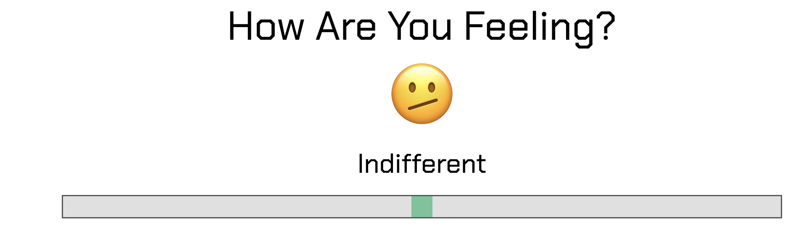
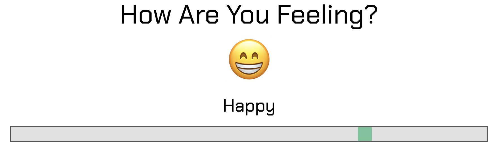
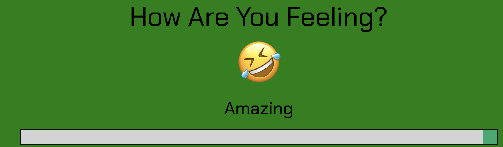
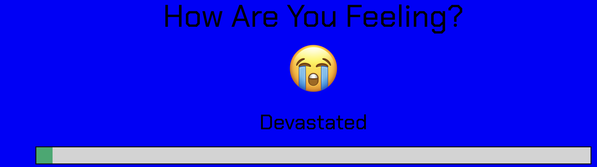

# Documentation

## Overview
We created 2 widgets - the Task List and the Sentiment Analysis

- The task list widget is a simple yet powerful tool designed to streamline task management and keep users on track. Are you overwhelmed with tasks and often find yourself forgetting important deadlines? Whether you're a busy professional juggling multiple responsibilities or a college student buried under assignments, our TaskList Widget is here to help! With its simple interface, you can easily add, remove, and update tasks.

- The slider widget provides a user-friendly interface element for adjusting values within a predefined range by sliding a handle along a track. User is asked how they are feeling and user can choose from **Devastated** to **Amazing** with its respective background color and emoji. Additionally, choosing **Amazing** results in money emojis falling from the top of the screen to the bottom (bringing our team Triton Financial Solutions's theme into the picture).


## Audience and User Stories


## Features and Usage (Task List Widget)
### Add tasks
Adding tasks can be done at the top of the TODO List. This can be done by entering a task name, task description (optional), applying a tag, and entering a date. The 'plus' button can then be pressed to add this new task to the list.

#### Relevant Code:  
#### High Level Explanation:  
The JS aims to generate a submission form within the form-row div and applies an event listener to the submission button. The HTML acts as a fallback incase JS does not load and displays the form but does nothing. 
The returnSubmission() function generates the entire form within JS completely fresh and calls submitButtonUpdate() which adds the event listener. On trigger, the button will then call returnSubmission to reset the form, then a submissionErrorHandler() to make sure the input is valid. After this, it calls the addRow() function which adds the data to the current existing data and rerenders the list so the new entry is visible.  

#### HTML:
```
<div class="form-row" id="form-row">
  ... 
</div>
```
#### JS:
```
function returnSubmission(){
  ...
  submitButtonUpdate();
}

function submitButtonUpdate(){
  document.getElementById('submitButton').addEventListener('click', function(event){
    ...
    returnSubmission();
    if (submissionErrorHandler(task,desc,tag,date) > 0){
      addRow([{task,prio,comp,date,tag,desc}]);
    }
  })
}

function addRow(row){
  renderList(sortTasks(currentData().concat(row)));
}

function renderList(data){
  ...
}
```

### Delete tasks
Deleting tasks can be done by clicking on the trash can icon under 'ACTIONS' for each of the tasklist elements. This will remove the task from the list entirely.

#### Relevant Code:  
#### High Level Explanation:
delCheckboxUpdate() takes all labelled deletion checkboxes and applies a deleteRow() function to all of them. These checkboxes are generated on renderList() call and delCheckboxUpdate() applies event listeners 
to all of them to delete the row they are currently in. deleteRow() takes the last node of a row and iterates backwards to get all nodes into a deletion array, after which all nodes are deleted.  

#### JS:
```
function delCheckboxUpdate(){
  ...
  checkboxArr.forEach(checkbox => {
    checkbox.addEventListener('change', () => {
      if (checkbox.checked == true){
        ...
        deleteRow(checkbox.parentNode);
      }
    })
  })
}

function deleteRow(lastNode){
  ...
  const delList = [currNode, dateNode, tagNode, taskNode, prioNode];
  delList.forEach(node => {
    node.parentNode.removeChild(node);
  })
}
```
### Read in tasks
With current implementation, this can only be done by modifying the data.json file in the directory that index.html is in. Therefore this cannot be done when accessing the webapp test production build online. 
However, this can be done locally by fielding the necessary elements into the JSON file with each item having a 'task', 'tag', 'desc', 'complete', 'prio'. Implementation to do this through a textfield or import 
could be considered but due to time constraints we have decided to not pursue this feature further.

### Prioritize tasks
Prioritizing tasks can be done by clicking on the star on the left of each task. A blank star means it is not prioritized while a filled in star means it is. Prioritizing a task brings it to the top of the list so they are seen first.

#### Relevant Code:
#### High Level Explanation:
Every priority star is a checkbox that assigns priority based on the checked state of the checkbox in the currentData() function. So when currentData() is called, it checks all priority checkbox states and updates the dictionary with all of those values. This then re-renders the list.

#### JS:
```
function checkboxUpdate(){
    ...
    checkboxArr.forEach(checkbox => {
        checkbox.addEventListener('change', () => {
            renderList(currentData());
        });
    });
}
```

### Edit tasks
Existing tasks can be edited by clicking on the edit button under the 'ACTIONS' column. These tasks have a pen icon and are green. Editing a task will cause it to replace the empty submission boxes at the top with the existing task and turn the submission button green. Once filled in, the submission form will edit the existing task rather than create a new task.

#### Relevant Code
#### High Level Explanation:
Edit checkboxes are given listeners to check for a state change, which then generates an 'editing' submission form where the usual add task is. editCheckboxUpdate() updates checkboxes with event listeners and calls genSubmissionEdit() which generates the new form. At the end of that, it reverts the input form back to normal afterwards.

#### JS:
```
function editCheckboxUpdate(){
    ...
    checkboxArr.forEach(checkbox => {
        checkbox.addEventListener('change', () => {
            if (checkbox.checked == true){
                ...
                genSubmissionEdit(rowNodes);
            }
        });
    });
}

function genSubmissionEdit(nodeArr){
  ...
  document.getElementById('submitButton').addEventListener('click', function(event){
    ...
    if (submissionErrorHandler(task,desc,tag,date) > 0){
            const replacementData = searchAndDelete(...)
            renderList(replacementData[0]);
            ...
            returnSubmission();
    }
    ...
  })
}
```

### Task Description
(ADD FUNCTION DESCRIPTION)
### Task Sorting
(ADD FUNCTION DESCRIPTION)

## Features and Usage (Slider Widget)
**Select** and **Hold** the Range slider handle and **Move** left to right

### Indifferent (Initial State)

 
 
```
  emojiDisplay.textContent = '🫤'; // Neutral Face
          feelingTxt.textContent = 'Indifferent'; 
          changeBackgroundColor('white');
          break;
```

### Happy (Move Slider Right Once)



```
 emojiDisplay.textContent = '😁'; // Smiling Face with Teeth
          feelingTxt.textContent = 'Happy'; 
          changeBackgroundColor('white');
          break;
```

### Amazing (Move Slider Right Twice)



```
emojiDisplay.textContent = '🤣'; // Crying Laughing Face
          feelingTxt.textContent = 'Amazing'; 
          startDollarRain();
          changeBackgroundColor('green');
          break;
```

### Sad (Move Slider Left Once)


```
 emojiDisplay.textContent = '😢'; // Face with Sad Tear
          feelingTxt.textContent = 'Sad'; 
          changeBackgroundColor('white');
          break;
```

### Devastated (Move Slider Left Twice)



```
 emojiDisplay.textContent = '😭'; // Crying Emoji
          feelingTxt.textContent = 'Devastated';
          changeBackgroundColor('blue');
          break;
```
                              

## Wireframes and Diagrams

Initially, in our first brainstorming meeting, we created a rough diagram of what we wanted both our widget to look like:


Then, we did some sketch wireframes to see how it would all fit together and draw inspiration:


Then, we created a wireframe for the same diagram to organize our ideas properly:


## Design Insights and Philosophy
- Due to time constraints, we prioritized basic functionality in our app and took design inspirations from another task list app available online ([Link here](https://github.com/abdellatif-laghjaj/todo-list))
- Building upon this foundation, we incorporated various other features to enhance the user experience for our target audience. These additional features are imperative for making sure that our applicaton is easy to use and contributes significantly to user satisfaction.
- Our approach centered on code-first development. Given that a task list relies heavily on JavaScript for interactivity, we adopted a minimal HTML structure, relying on CSS and JavaScript to drive functionality and visual presentation.
- Our approach remained similar for the slider widget

## Installation
- Task list: ADD HERE
- Slider: Use [this link](https://html-preview.github.io/?url=https://github.com/cse110-sp24-group18/warmup-exercise/blob/slider-full-implementation/slider/slider-widget.html) to run program.


## Accessibility
- Both applications are adaptive to screen size and tested to work on very small screens.
- We used a colorblind palette to accomodate for colorblind people.


## Testing and Troubleshooting
- No Major Programming issues, simple quality of life adjustments such as smoothness and improvements in visual design.


## Limitations
- Due to time contraints, instead of adding a ton of guards everywhere, we opted to limited amount of possible text in task names and descriptions as a compromise. 
- Also could not push certain other features like creating a task with priority, etc. Time is the biggest limiting factor.
- For the slider, simplicity of program does not allow diverse changes

## Acknowledgements
Michael Cheung, Min Kim, Taiki Yoshino
