# Warmup Exercise Documentation (Task List and Slider Widget)

## Overview
We created 2 widgets - the Task List and the Sentiment Analysis

- The task list widget is a simple yet powerful tool designed to streamline task management and keep users on track. Are you overwhelmed with tasks and often find yourself forgetting important deadlines? Whether you're a busy professional juggling multiple responsibilities or a college student buried under assignments, our TaskList Widget is here to help! With its simple interface, you can easily add, remove, and update tasks.

- The slider widget provides a user-friendly interface element for adjusting values within a predefined range by sliding a handle along a track. User is asked how they are feeling and user can choose from **Devastated** to **Amazing** with its respective background color and emoji. Additionally, choosing **Amazing** results in money emojis falling from the top of the screen to the bottom (bringing our team Triton Financial Solutions's theme into the picture).


## Audience and User Stories


## Features and Usage (Task List Widget)
### Add tasks
Adding tasks can be done at the top of the TODO List. This can be done by entering a task name, task description (optional), applying a tag, and entering a date. The 'plus' button can then be pressed to add this new task to the list.

#### Relevant Code:  
#### High Level Explanation:  
The JS aims to generate a submission form within the form-row div and applies an event listener to the submission button. The HTML acts as a fallback incase JS does not load and displays the form but does nothing. 
The returnSubmission() function generates the entire form within JS completely fresh and calls submitButtonUpdate() which adds the event listener. On trigger, the button will then call returnSubmission to reset the form, then a submissionErrorHandler() to make sure the input is valid. After this, it calls the addRow() function which adds the data to the current existing data and rerenders the list so the new entry is visible.  

#### HTML:
```
<div class="form-row" id="form-row">
  ... 
</div>
```
#### JS:
```
function returnSubmission(){
  ...
  submitButtonUpdate();
}

function submitButtonUpdate(){
  document.getElementById('submitButton').addEventListener('click', function(event){
    ...
    returnSubmission();
    if (submissionErrorHandler(task,desc,tag,date) > 0){
      addRow([{task,prio,comp,date,tag,desc}]);
    }
  })
}

function addRow(row){
  renderList(sortTasks(currentData().concat(row)));
}

function renderList(data){
  ...
}
```

### Delete tasks
Deleting tasks can be done by clicking on the trash can icon under 'ACTIONS' for each of the tasklist elements. This will remove the task from the list entirely.

#### Relevant Code:  
#### High Level Explanation:
delCheckboxUpdate() takes all labelled deletion checkboxes and applies a deleteRow() function to all of them. These checkboxes are generated on renderList() call and delCheckboxUpdate() applies event listeners 
to all of them to delete the row they are currently in. deleteRow() takes the last node of a row and iterates backwards to get all nodes into a deletion array, after which all nodes are deleted.  

#### JS:
```
function delCheckboxUpdate(){
  ...
  checkboxArr.forEach(checkbox => {
    checkbox.addEventListener('change', () => {
      if (checkbox.checked == true){
        ...
        deleteRow(checkbox.parentNode);
      }
    })
  })
}

function deleteRow(lastNode){
  ...
  const delList = [currNode, dateNode, tagNode, taskNode, prioNode];
  delList.forEach(node => {
    node.parentNode.removeChild(node);
  })
}
```
### Read in tasks
With current implementation, this can only be done by modifying the data.json file in the directory that index.html is in. Therefore this cannot be done when accessing the webapp test production build online. 
However, this can be done locally by fielding the necessary elements into the JSON file with each item having a 'task', 'tag', 'desc', 'complete', 'prio'. Implementation to do this through a textfield or import 
could be considered but due to time constraints we have decided to not pursue this feature further.

### Prioritize tasks
Prioritizing tasks can be done by clicking on the star on the left of each task. A blank star means it is not prioritized while a filled in star means it is. Prioritizing a task brings it to the top of the list so they are seen first.

#### Relevant Code:
#### High Level Explanation:
Every priority star is a checkbox that assigns priority based on the checked state of the checkbox in the currentData() function. So when currentData() is called, it checks all priority checkbox states and updates the dictionary with all of those values. This then re-renders the list.

#### JS:
```
function checkboxUpdate(){
    ...
    checkboxArr.forEach(checkbox => {
        checkbox.addEventListener('change', () => {
            renderList(currentData());
        });
    });
}
```

### Edit tasks
Existing tasks can be edited by clicking on the edit button under the 'ACTIONS' column. These tasks have a pen icon and are green. Editing a task will cause it to replace the empty submission boxes at the top with the existing task and turn the submission button green. Once filled in, the submission form will edit the existing task rather than create a new task.

#### Relevant Code:
#### High Level Explanation:
Edit checkboxes are given listeners to check for a state change, which then generates an 'editing' submission form where the usual add task is. editCheckboxUpdate() updates checkboxes with event listeners and calls genSubmissionEdit() which generates the new form. At the end of that, it reverts the input form back to normal afterwards.

#### JS:
```
function editCheckboxUpdate(){
    ...
    checkboxArr.forEach(checkbox => {
        checkbox.addEventListener('change', () => {
            if (checkbox.checked == true){
                ...
                genSubmissionEdit(rowNodes);
            }
        });
    });
}

function genSubmissionEdit(nodeArr){
  ...
  document.getElementById('submitButton').addEventListener('click', function(event){
    ...
    if (submissionErrorHandler(task,desc,tag,date) > 0){
            const replacementData = searchAndDelete(...)
            renderList(replacementData[0]);
            ...
            returnSubmission();
    }
    ...
  })
}
```

### Task Description
Each task has a description that can be opened below the task. This can be done with the information button that opens up a description box signified by the information symbol with an 'i'.
### Relevant Code:
### High Level Explanation:
compCheckboxUpdate() goes through all the description buttons and makes them open the descriptions for corresponding rows.
### JS:
```
function compCheckboxUpdate(){
    ...
    checkboxArr.forEach(checkbox => {
        checkbox.addEventListener('change', () => {
                ...
                const descriptions = document.querySelectorAll(`#task-desc`);
                descriptions.forEach(desc => {
                    if (desc.className == taskName){
                        if (checkbox.checked == true){
                            desc.style.display = 'grid';
                        } else {
                            desc.style.display = 'none';
                        }
                    }
                })
        });
    });
}
```

### Task Sorting
A feature of the list by is that the list is sorted by priority and date by default. The list first sorts by priority, then within the priorities it will sort by earliest date.
### Relevant Code:
### High Level Explanation:
sortTasks() sorts the dictionary by priority then date. This function is run before every instance renderList() to sort the rendered list.

### JS:
```
function sortTasks(tasks){
    ...
    return tasks;
}
```

## Features and Usage (Slider Widget)
**Select** and **Hold** the Range slider handle and **Move** left to right

### Indifferent (Initial State)

 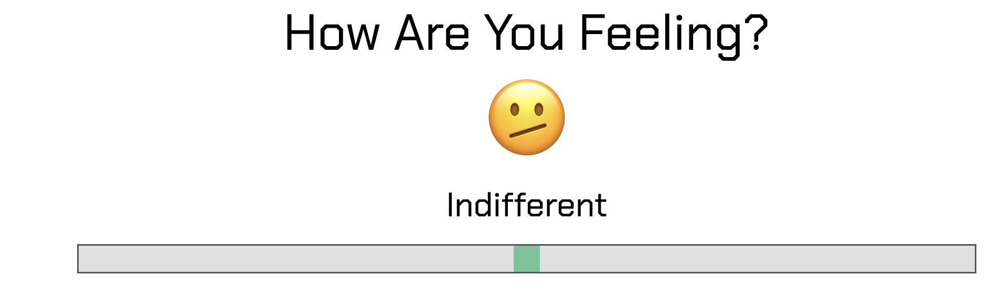
 
```
  emojiDisplay.textContent = '🫤'; // Neutral Face
          feelingTxt.textContent = 'Indifferent'; 
          changeBackgroundColor('white');
          break;
```

### Happy (Move Slider Right Once)

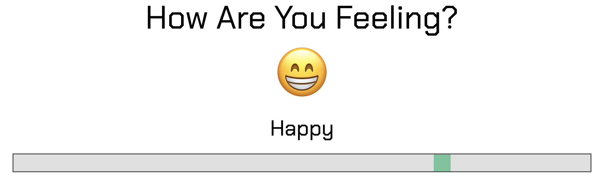

```
 emojiDisplay.textContent = '😁'; // Smiling Face with Teeth
          feelingTxt.textContent = 'Happy'; 
          changeBackgroundColor('white');
          break;
```

### Amazing (Move Slider Right Twice)

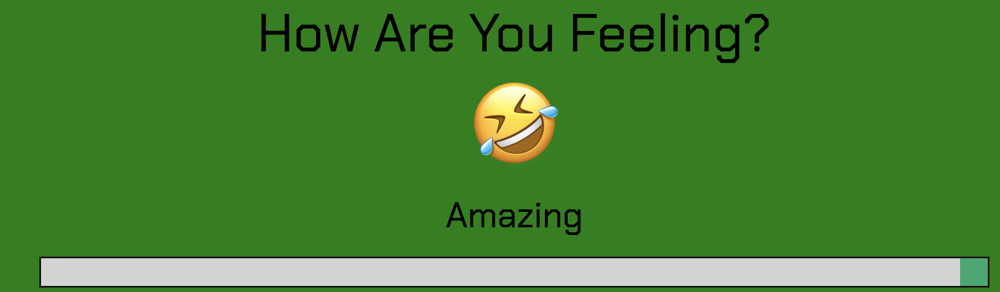

```
emojiDisplay.textContent = '🤣'; // Crying Laughing Face
          feelingTxt.textContent = 'Amazing'; 
          startDollarRain();
          changeBackgroundColor('green');
          break;
```

### Sad (Move Slider Left Once)

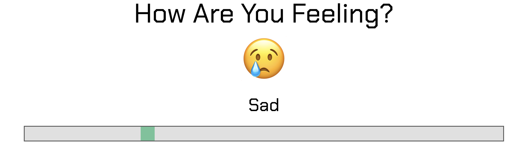

```
 emojiDisplay.textContent = '😢'; // Face with Sad Tear
          feelingTxt.textContent = 'Sad'; 
          changeBackgroundColor('white');
          break;
```

### Devastated (Move Slider Left Twice)

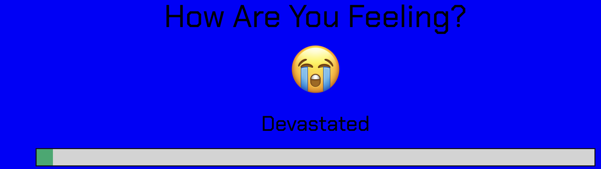

```
 emojiDisplay.textContent = '😭'; // Crying Emoji
          feelingTxt.textContent = 'Devastated';
          changeBackgroundColor('blue');
          break;
```
                              

## Wireframes and Diagrams

Initially, in our first brainstorming meeting, we created a rough diagram of what we wanted both our widget to look like:


Then, we did some sketch wireframes to see how it would all fit together and draw inspiration:


Then, we created a wireframe for the same diagram to organize our ideas properly:


## Design Insights and Philosophy
- Due to time constraints, we prioritized basic functionality in our app and took design inspirations from another task list app available online ([Link here](https://github.com/abdellatif-laghjaj/todo-list))
- Building upon this foundation, we incorporated various other features to enhance the user experience for our target audience. These additional features are imperative for making sure that our applicaton is easy to use and contributes significantly to user satisfaction.
- Our approach centered on code-first development. Given that a task list relies heavily on JavaScript for interactivity, we adopted a minimal HTML structure, relying on CSS and JavaScript to drive functionality and visual presentation.
- Our approach remained similar for the slider widget

## Installation
- Task list: Use [this link](https://hosting-test-production-67d1.up.railway.app/) (We hosted our program on a website)
- Slider: Use [this link](https://html-preview.github.io/?url=https://github.com/cse110-sp24-group18/warmup-exercise/blob/slider-full-implementation/slider/slider-widget.html) to run program.


## Accessibility
- Both applications are adaptive to screen size and tested to work on very small screens.
- We used a colorblind palette to accomodate for colorblind people.


## Testing and Troubleshooting
- For testing and troubleshooting, we employed a combination of JUnit tests and GitHub Issues to ensure the stability of our widgets while also facilitating effective communication and issue resolution within our team.

### Task List Manual Unit Testing
The overall goal of the unit tests is to test each interaction seperately, then test for any conflicting interactions. Interactions include adding tasks, prioritizing tasks, editing tasks, displaying task descriptions, and deleting tasks. Even if there are limited explanations for each test, all screenshots are under DocumentationImages/TaskListTesting and include much more extensive testing than shown in the screenshots in this documentation. Every interaction gets tested for each test. i.e. prio, description, edit, and delete.
### Overall Tests:
```
test 1: Base Case {test1, this is a test, School, 04/02/2024}
test 2: Base Case {test2, also a test, Misc, 02/01/2022}
test 3: no name {, blank test, Personal, 01/01/2000}
test 4: no desc {test4,, Work, 12/23/1988}
test 5: Base Case {test5, testing, School, 9/1/2002}
test 6: no date {test6, no date, Misc,}

test 7: edit->delete {test7, editdelete, Personal, 01/20/2303}
test 8: edit->edit {test8, editedit, Work, 02/23/1111}
test 9: empty list {}
test 10: long name {aaaaaaaaaaaaaaaaaaaaaaaaaaaaaaaaaaaaaaaaaaaaaaaaaaaaaaaaaaaaaaaaaaaaaaaaaaaaaaaaaaaaaaaaa, long name, Misc, 01/01/0001}
test 11: long desc {test11, aaaaaaaaaaaaaaaaaaaaaaaaaaaaaaaaaaaaaaaaaaaaaaaaaaaaaaaaaaaaaaaaaaaaaaaaaaaaaaaaaaaaaaaaa, Misc, 01/01/0001}
test 12: letters in date (i literally couldnt type it in)

test 13: emojis {😋, 😋, Personal, 01/09/2002}
```
### Test 1
Test 1 is a base case which simulates a regular user iteraction. The first set of images is adding a task:

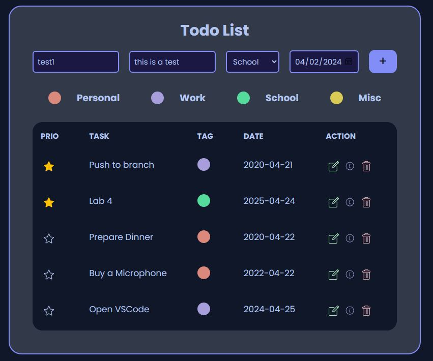
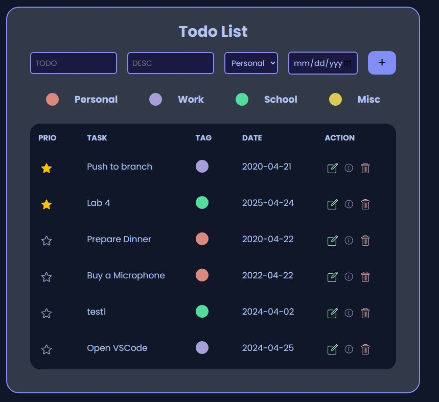

The next set of images is showing the description and priority functions working:

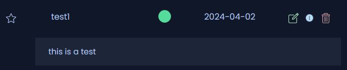
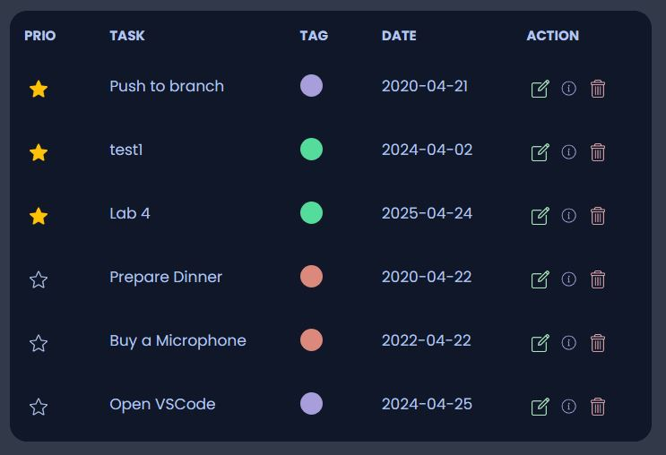

And the last set of images shows the editing function working:

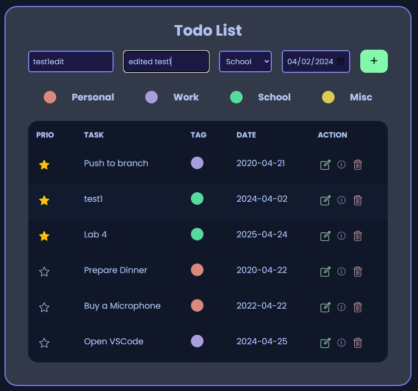
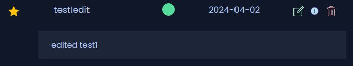

### Test 2
Test 2 is a base case which also simulates regular user iteraction. For the sake of repitition, the other tests all performed similarly, the screenshots are in the directory under DocumentationImages/TaskListTesting/test2.

### Test 3
Test 3 tries to add a task with no task name, this results in an error, sending an alert to the user.

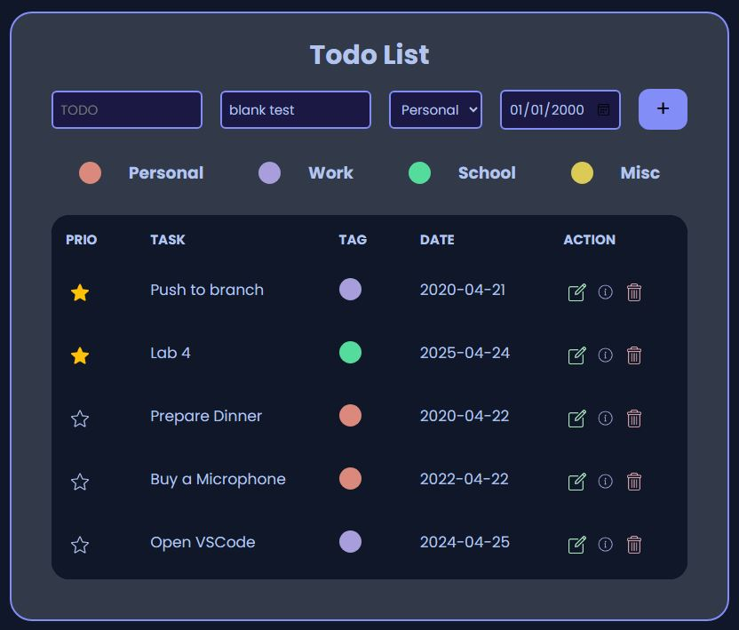
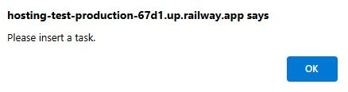
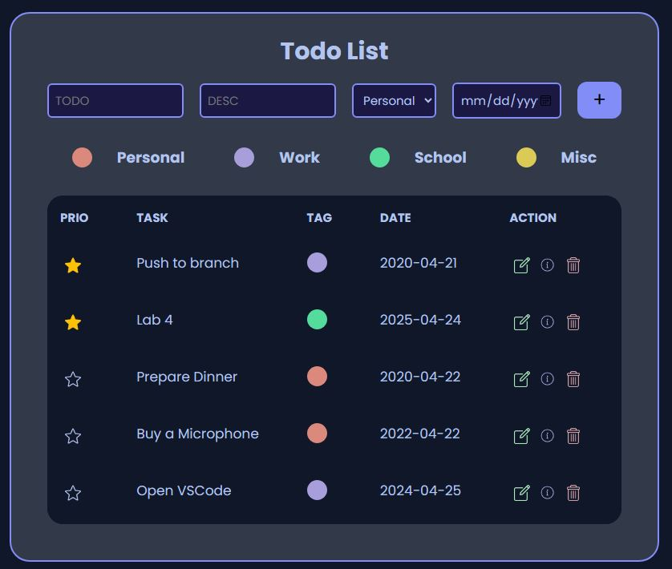

### Test 4
Test 4 tries to add a task with no description, the intended interaction is that the task just exists with an empty description. More interactions were tested after this including testing editing and prioritizing the task entry with no description. The screenshots are in the directory under DocumentationImages/TaskListTesting/test4.

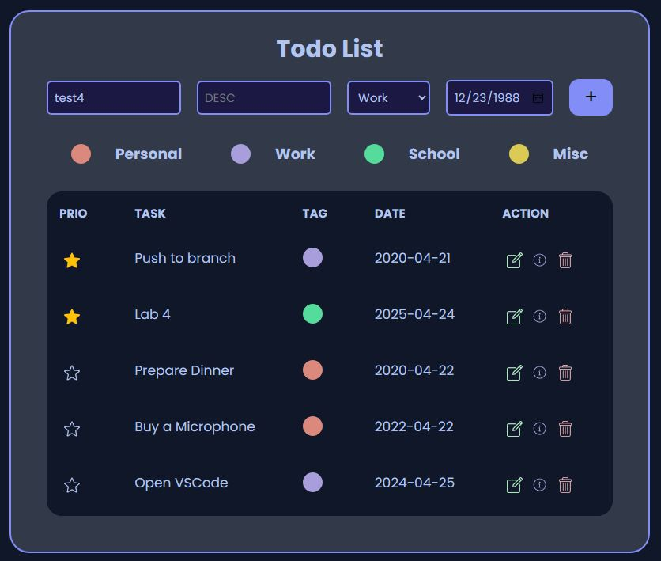
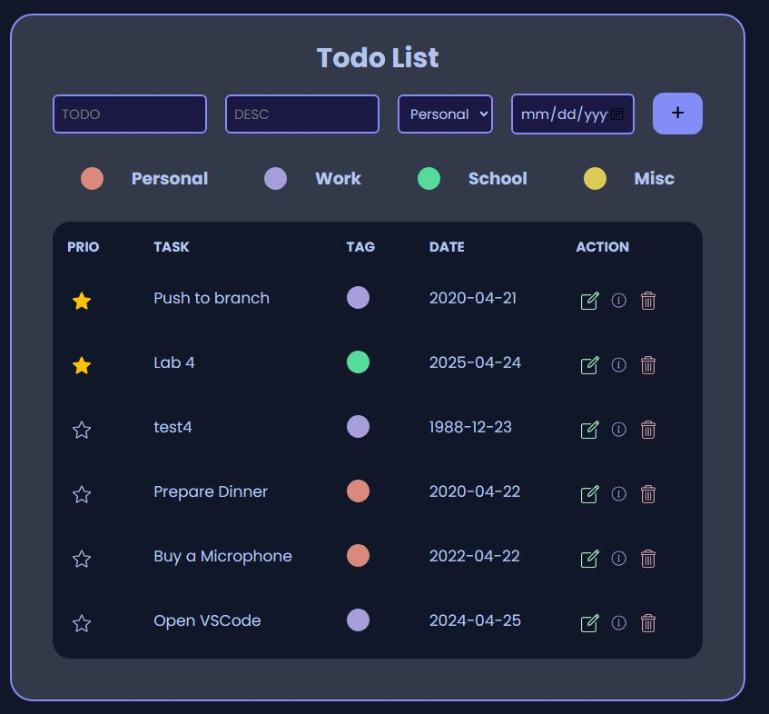
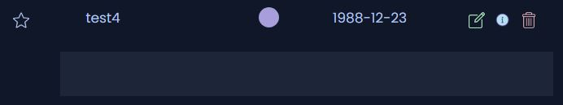

### Test 5
Test 5 is also a base case so for the sake of repitition it will be skipped over in this summary, but the screenshots are in the directory under DocumentationImages/TaskListTesting/test5.

### Test 6
Test 6 is a test with no date. The test works as intended with the task being sent to the bottom of the task list due to having an indefinite date during the sort.

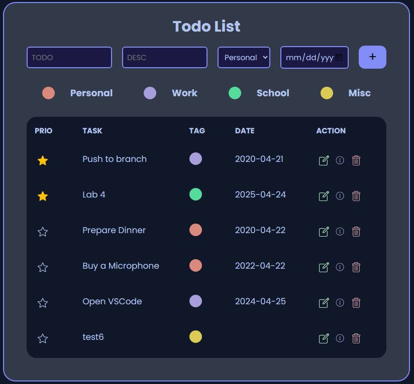

### Test 7
Test 7 is a test for any confliciting interaction between edit and delete. The intended iteraction is that editing first then deleting the entry should then add a new entry with the submission. Something that could be improved after running this test is the button should go from green to blue to signify going from 'edit' mode to 'add' mode to the user.

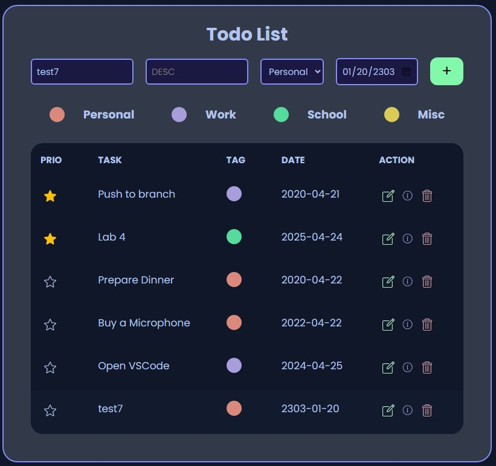
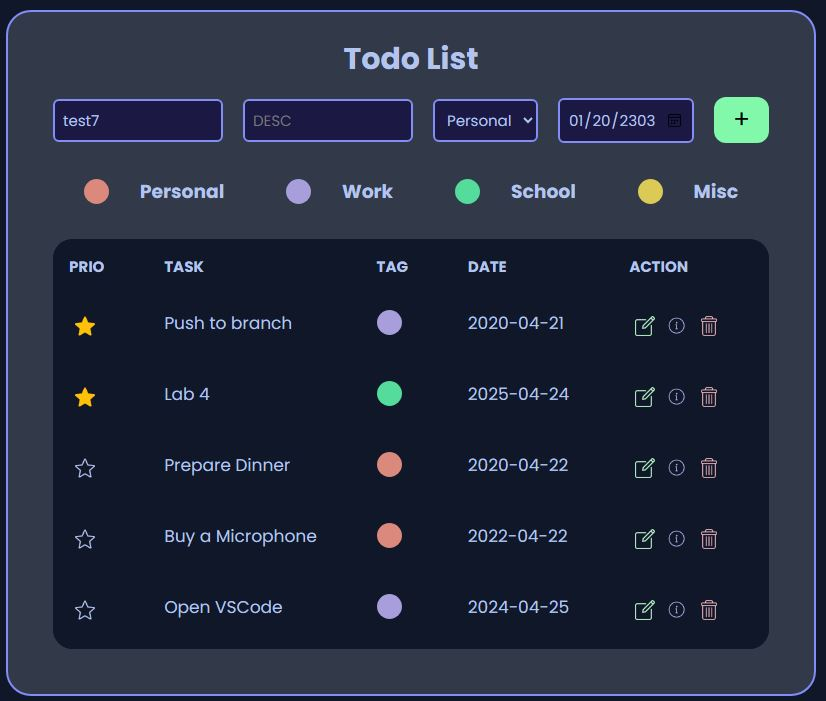
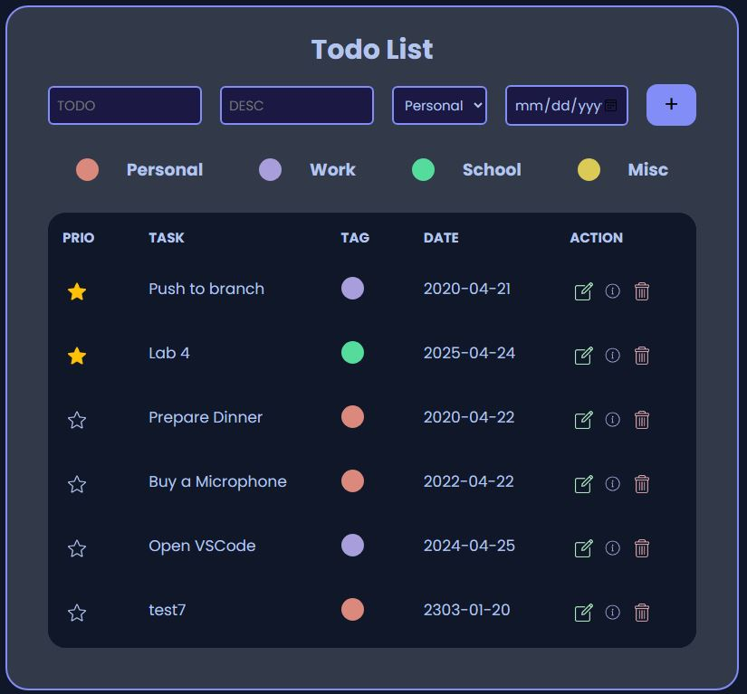

### Test 8
Test 8 is a test for any conflicting interaction between edit and another edit. The intended iteraction is that editing twice just replaces the submission form with the most recent edit entry and that is how it works. Screenshots are in the directory under DocumentationImages/TaskListTesting/test8.

### Test 9
Test 9 tests to see what happens when there are no longer tasks in the list.

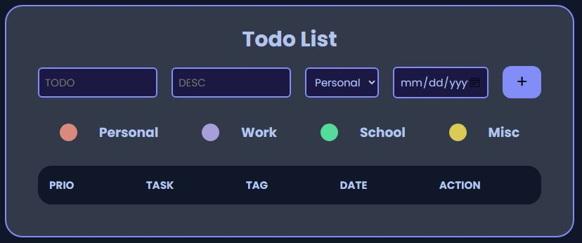

### Test 10
Test 10 tests entering an extremely long task name. This results in another error and the user is alerted.

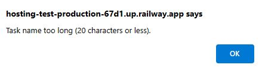

### Test 11
Test 11 tests entering a long description. This results in another error and the user is alerted.

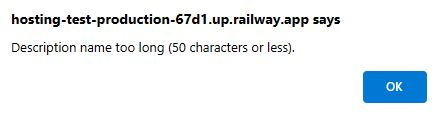

### Test 12
Test 12 tests whether emojis work in the tasks. Since the emojis are just characters, they work as normal. Screenshots in DocumentationImages/TaskListTesting/test12.

### GitHub Issues
- To track and manage issues encountered during testing and development, we utilized GitHub's issue tracking system. We created detailed issue reports for each identified problem, including bug reports and feature requests.


## Limitations
- Due to time contraints, instead of adding a ton of guards everywhere, we opted to limited amount of possible text in task names and descriptions as a compromise. 
- Also could not push certain other features like creating a task with priority, etc. Time is the biggest limiting factor.
- For the slider, simplicity of program does not allow diverse changes

## Acknowledgements
Ishika Agrawal, Bernico Chandra, Michael Cheung, Min Kim, Taiki Yoshino, Ryan Seidl, Elijah Hosaka, Sam Hormozian, Aritra Dutta, Rick Rodness, Sarena
