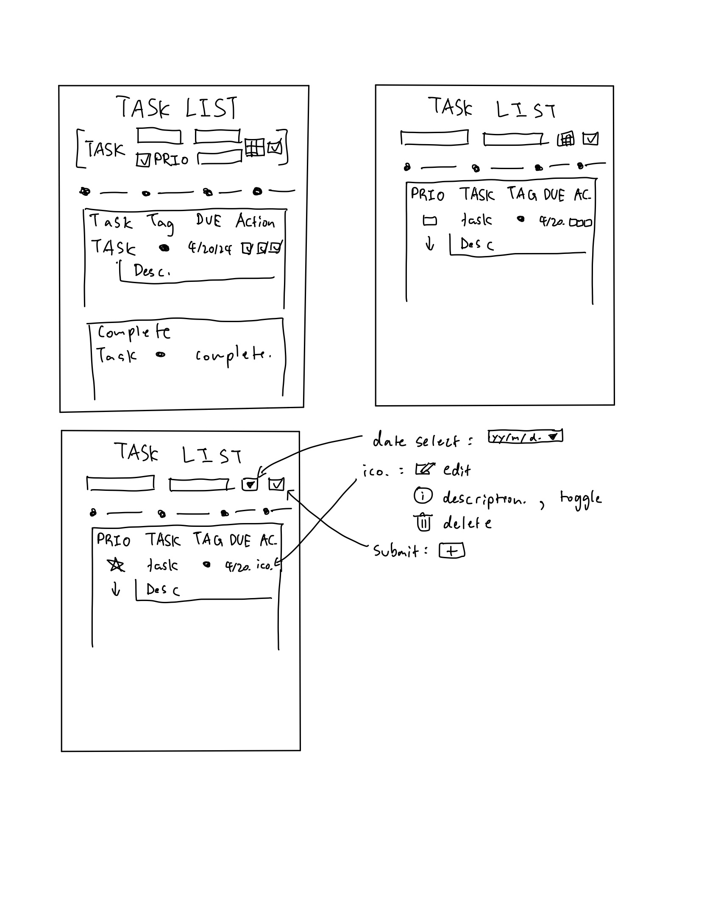

# Task List
Description goes here

## Audience
Students (Us, elaborate)

## Required Features
Ability to add tasks, ability to delete tasks, ability to read in tasks, ability to existing tasks.

## Audience Specific Features
As a student, I want the ability to: tag tasks for school/personal/wtv., add a short description to the task, add a date to the task, 
ability to prioritise important tasks, have the tasks be sorted, dark mode interface for my eyes.

## Design Insights
Due to short timeframe, we took the ideas of what we deemed as necessary features for our audience built this up with heavily inspired visuals from a different task list app.
https://github.com/abdellatif-laghjaj/todo-list (link this)
After this we added other features that we thought would be useful for the target audience as listed above. These are not necessary to functionality but enhance the user experience.
### Design Philosophy
We took a code first approach to this because a task list is not going to work with no JavaScript anyways. The HTML is mostly blank and all the functionality works through the CSS and JS combined. 
We believe this the correct approach because the it is impossible to convey any functionality through just HTML and the target audience is likely to have access to working JS.

## Wireframe

This is the wireframe for the project. Initially we decided on the top left design as a starting point after discussion of basic features we wanted. Then with some inspiration, we decided to make 
the design look more minimalistic and removed the need for a 'complete' section after some discussion. Then the design was more or less finalized after that.

# Task List Usage

## Installation
https://hosting-test-production-67d1.up.railway.app/
Access the current production site here.

## Accessibility
Not all the buttons can be tabbed to, but tasks can still be added by tabbing.
Application is adaptive to screen size and tested to work on very small screens.
Colorblind palette to accomodate for colorblind

## Application Overview

### Application Features
Top row to add new tasks (ADD PICTURES)
Under that is legend with tasks
Under that is actual tasklist
On the left is the priority button to prioritise tasks
The 3 action buttons on the right are:
EDIT (add explaination and pictures)
DESCRIPTION
DELETE

### Usage
Explain usage, through example use cases

### Live Demo
Video here

## Limitations
Due to time contraints, instead of adding a ton of guards everywhere, opted to limited amount of possible text in task names and descriptions as a compromise. 
Also could not push certain other features like creating a task with prio, etc. Time is the biggest limiting factor. The other large limiting factor is opting out of 
using a database for this project and working around that due to programming and time constraints. This would have lowered code complexity significantly.

## Acknowledgements
Michael Cheung, Min Kim, Taiki Yoshino
