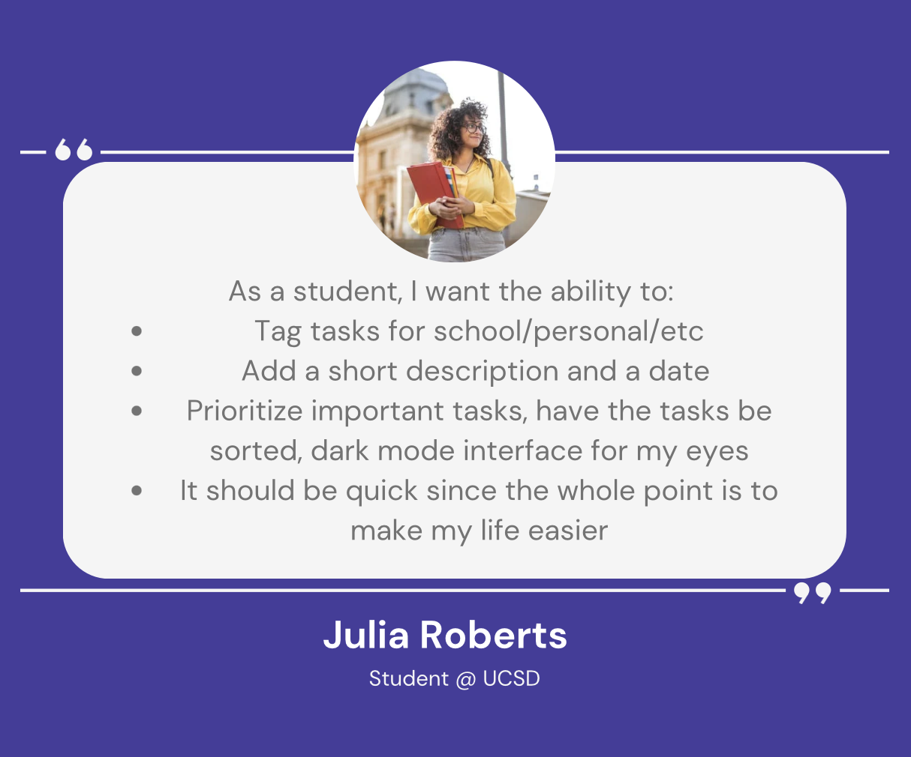

# Task List

## Overview
Are you overwhelmed with tasks and often find yourself forgetting important deadlines? Whether you're a busy professional juggling multiple responsibilities or a college student buried under assignments, our TaskList Widget is here to help! The Task List Widget is a simple yet powerful tool designed to streamline task management and keep you on track. With its simple interface, you can easily add, remove, and update tasks.
## Audience and User Stories

## Required Features
### Add tasks
(ADD FUNCTION DESCRIPTION)
### Delete tasks
(ADD FUNCTION DESCRIPTION)
### Read in tasks
(ADD FUNCTION DESCRIPTION)
### Prioritize tasks
(ADD FUNCTION DESCRIPTION)
### Delete tasks
(ADD FUNCTION DESCRIPTION)
### Sort tasks based on due date
(ADD FUNCTION DESCRIPTION)

## Design Insights
Due to short timeframe, we took the ideas of what we deemed as necessary features for our audience built this up with heavily inspired visuals from a different task list app.
https://github.com/abdellatif-laghjaj/todo-list (link this)
After this we added other features that we thought would be useful for the target audience as listed above. These are not necessary to functionality but enhance the user experience.
### Design Philosophy
We took a code first approach to this because a task list is not going to work with no JavaScript anyways. The HTML is mostly blank and all the functionality works through the CSS and JS combined. 
We believe this the correct approach because the it is impossible to convey any functionality through just HTML and the target audience is likely to have access to working JS.

## Accessibility
Not all the buttons can be tabbed to, but tasks can still be added by tabbing.
Application is adaptive to screen size and tested to work on very small screens.
Colorblind palette to accomodate for colorblind

## Application Overview
Top row to add new tasks (ADD PICTURES)
Under that is legend with tasks
Under that is actual tasklist
On the left is the priority button to prioritise tasks
The 3 action buttons on the right are:
EDIT (add explaination and pictures)
DESCRIPTION
DELETE

## Limitations
Due to time contraints, instead of adding a ton of guards everywhere, opted to limited amount of possible text in task names and descriptions as a compromise. 
Also could not push certain other features like creating a task with prio, etc. Time is the biggest limiting factor.

## Members
Michael Cheung, Min Kim, Taiki Yoshino
