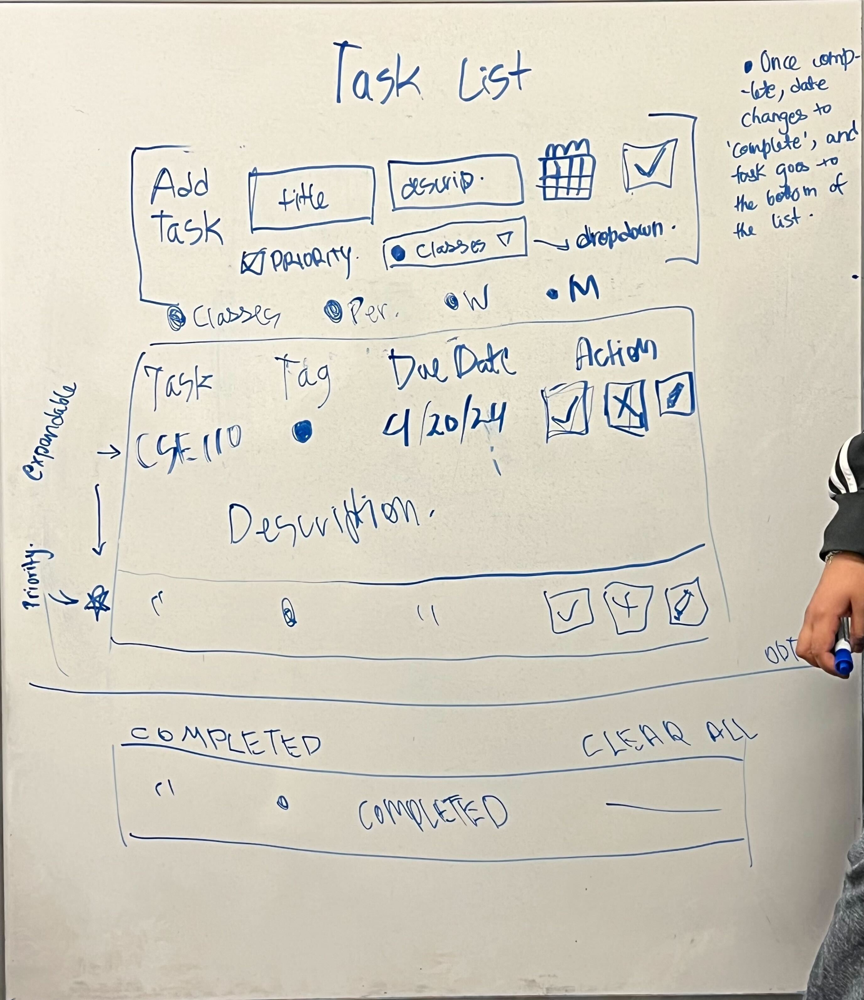
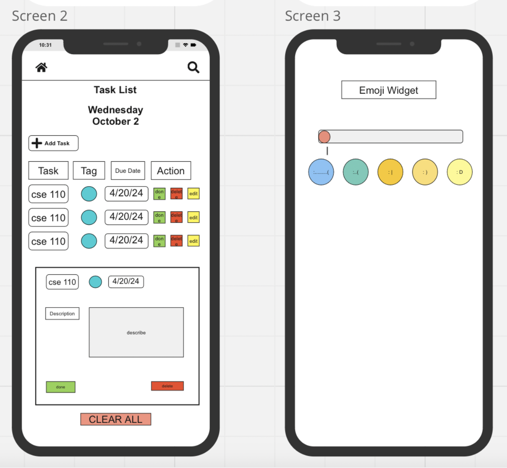

# Task List

## Overview
Are you overwhelmed with tasks and often find yourself forgetting important deadlines? Whether you're a busy professional juggling multiple responsibilities or a college student buried under assignments, our TaskList Widget is here to help! The Task List Widget is a simple yet powerful tool designed to streamline task management and keep you on track. With its simple interface, you can easily add, remove, and update tasks.

## Audience and User Stories

## Features and Usage
### Add tasks
(ADD FUNCTION DESCRIPTION)
### Delete tasks
(ADD FUNCTION DESCRIPTION)
### Read in tasks
(ADD FUNCTION DESCRIPTION)
### Prioritize tasks
(ADD FUNCTION DESCRIPTION)
### Delete tasks
(ADD FUNCTION DESCRIPTION)
### Sort tasks based on due date
(ADD FUNCTION DESCRIPTION)

## Wireframes and Diagrams

Initially, in our first brainstorming meeting, we created a rough diagram of what we wanted our widget to look like:

Then, we created a wireframe for the same diagram to organize our ideas properly:

## Design Insights and Philosophy
Due to time constraints, we prioritized basic functionality in our app and took design inspirations from another task list app available online.
https://github.com/abdellatif-laghjaj/todo-list (link this)
Building upon this foundation, we incorporated various other features to enhance the user experience for our target audience. These additional features are imperative for making sure that our applicaton is easy to use and contributes significantly to user satisfaction.

Our approach centered on code-first development. Given that a task list relies heavily on JavaScript for interactivity, we adopted a minimal HTML structure, relying on CSS and JavaScript to drive functionality and visual presentation.

## Installation

## Accessibility
Not all the buttons can be tabbed to, but tasks can still be added by tabbing.
Application is adaptive to screen size and tested to work on very small screens.
Colorblind palette to accomodate for colorblind

## Application Overview
Top row to add new tasks (ADD PICTURES)
Under that is legend with tasks
Under that is actual tasklist
On the left is the priority button to prioritise tasks
The 3 action buttons on the right are:
EDIT (add explaination and pictures)
DESCRIPTION
DELETE

## Troubleshooting and Limitations
Due to time contraints, instead of adding a ton of guards everywhere, opted to limited amount of possible text in task names and descriptions as a compromise. 
Also could not push certain other features like creating a task with prio, etc. Time is the biggest limiting factor.

## Acknowledgements
Michael Cheung, Min Kim, Taiki Yoshino
